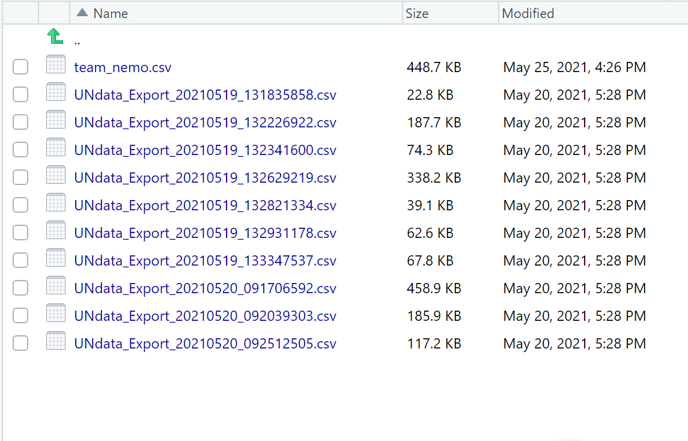

```{r setup, include=FALSE}
library(flexdashboard)
library(tidyverse)
library(ggpubr)
library(plotly)

```
Nemo {data-icon="fa-adjust"}
=============================

Row {data-width=150} 
--------------------------------------
### 

```{r}
valueBox(value= "Topic: Understanding Trade of Different Commodities in the following countries: " ,color = "green")
final <- read.csv("data/team_nemo.csv")
```


Row {data-width=150}
---------------------


### 
```{r germany, echo = F, fig.cap = "Germany", out.width = '100%'}

```


### 
```{r china, echo = F, fig.cap = "China", out.width = '100%'}

```


### 
```{r usa, echo = F, fig.cap = "USA", out.width = '100%'}
knitr::include_graphics("figs/usamap.jpg")
```


Column {data-width=150} {data-height=50}
--------------------------------------
###
```{r}
valueBox(value= "Presented by: Team Nemo " ,color = "green")
```


Row {data-width=150} {data-height=100}
--------------------------------------
### 
```{r}
valueBox(value= "Prachi Jaiswal" ,icon = "fa-user-plus",color = "red")
```

### 
```{r}
valueBox(value= "Yuwei Jiang" ,icon = "fa-user-plus", color = "red")
```

###
```{r}
valueBox(value= "Sithalakshmi Jawahar" ,icon = "fa-user-plus", color = "red")
```


Introduction {data-icon="fa-pencil"}
=============================
Row {data-width=250}
--------------------------------------

### 
```{r}
valueBox(value= "Introduction", color = "olive")
```

### 
```{r}
valueBox(value= "Data Source", color = "olive")
```

### 
```{r}
valueBox(value= "Data cleaning", color = "olive")
```


Column {data-height=250}
------------------

### **Introduction**

Given the recent Suez Canal fiasco, many countries were facing severe problems in trade markets. Which made us all curious to dive deeper into the subject.

For our analysis we will compare the export and import patterns over a span of 3 years. And according to World Statistical Review 2019, the countries that we have chosen are taken as the top three global trading economies.


For our analysis we are comparing the export and import patterns of these countries over a span of three years to see if they have an import or export deficit, if so, which sector is causing the same. Sectors where they have good in- house production and where they need the materials from other countries. 


### **Data Source**

This report contains data taken from the UN Data Bank (http://data.un.org/Explorer.aspx). To answer our questions, we have selected the following factors to filter out a suitable data-set:


+ Database: Trade (Import and Export)


+ Countries: Germany, China, USA.


+ Time frame: 2016 to 2018.


row
------------------

### **Data Cleaning**
```{r datacleaning, echo = F, out.width = '5%'}
knitr::include_graphics("figs/capture.png")
```


### **Data Cleaning Output**
```{r dataset, echo = F, out.width = '5%'}

```


Germany {data-icon="fa-globe"}
=============================


Column {.tabset data-width=700}
-----------------------------------------------------------------------
<b><font face="Georgia" size="5em" color="#063c91">Traded goods in Germany</font></b>

### **Five Most Traded Goods in Germany**

```{r}

germany <- final %>% filter(Country == "Germany") %>% mutate(Trade = Trade/1000000000) 
germany_import <- germany %>% filter(Flow == "Import")
germany_export <- germany %>% filter(Flow == "Export")


germany%>% 
  filter(Category %in% c("rubber", "cars", "coffee", "pharma", "iron_steel"))%>%
  ggplot(aes(x = reorder(Category, -Trade),
  y = Trade, fill = Flow)) +
  geom_col(position = "dodge")+
  
  scale_y_continuous(labels=scales::dollar_format())+
  scale_fill_brewer(palette = "Dark2") +
  ylab("Trade in Billions")+
  
  facet_grid(~ Year)+ 
  theme(axis.title.x=element_blank())
ggplotly()

```


### **Five Least Traded Goods in Germany**

```{r }

germany%>% 
  filter(Category %in% c("tobacco", "fruits_nuts", "cotton", "sugar", "wheat"))%>%
  ggplot( mapping = aes(x = reorder(Category, -Trade),
  y = Trade, fill = Flow)) +
  geom_col(position = "dodge") +
  
  scale_y_continuous(labels=scales::dollar_format())+
  scale_fill_brewer(palette = "Set1")  +
  ylab("Trade in Billions")+
  
  facet_grid(~ Year)+
  theme(axis.title.x=element_blank())
ggplotly()

```


Row {data-width=350}
--------------------------------------

### **Traded goods over from 2016 to 2018**

```{r }

germany %>% 
  group_by(Category)%>% 
  plot_ly(labels = ~Category, values = ~Trade)%>% 
  add_pie(hole = 0.4)%>% 
  layout(title = " ",  showlegend = T,
          xaxis = list(showgrid = FALSE, zeroline = FALSE, showticklabels = FALSE),
          yaxis = list(showgrid = FALSE, zeroline = FALSE, showticklabels = FALSE))

```


### **Key Points:**

+ **Germany is an Export Dominant Economy.**

+ Germany is the most powerful economy of Europe with biggest export commodities as automobiles and medicaments.

+ Export is one of the vital factors that increase the foreign exchange reserves held in the nation's central bank.


+ When traders pay for exports either in their own currency or the U.S. dollars, and they are kept in the foriegn exchange reserves 


+ Foreign exchange reserves are cash and other reserve assets such as gold held by a central bank or other monetary authority


+ Country's Foreign exchange reserves are directly proportional to Country's own currency value.


+ Consequently lowes the cost of their exports


China {data-icon="fa-globe"}
=============================

Row {data-width=350}
--------------------------------------
### **Import Trades of China**
```{r}
China_ip <- final %>% filter(Country=="China") %>%
  filter(Flow=="Import")
China_ep <- final %>% filter(Country=="China") %>%
  filter(Flow=="Export")

China1 <- China_ip %>% group_by(Category, Year) %>%
  summarise(n=sum(Trade)) %>%
  mutate(Trade=n/1000000000) %>%
  mutate(Year=as.factor(Year))

China_import1 <- ggplot(China1 ,
               mapping=aes(x=reorder(Category, Trade),y=Trade))+
  geom_bar(stat="identity", position="dodge", aes(fill=Year), width = 0.6)+
  scale_fill_brewer(palette = 'Accent')+
  xlab("Category") +
    ylab("Trade(b)") +
  scale_y_continuous(labels=scales::dollar_format())+
  theme(legend.position="bottom", axis.text.x = element_text(angle=90,
                                   hjust=1,
                                   size=8))

China_import2 <- ggplot(China1, aes(x = Year,
    y = Trade, 
    color= Category, group = Category)) +
    geom_line() +
    xlab("Year") +
    ylab("Trade(b)") +
  scale_y_continuous(labels=scales::dollar_format())+
    theme_grey()+
  geom_point()

Import <- ggarrange(China_import1, China_import2,  
           ncol =2)
annotate_figure(Import,
                top = text_grob("Important Import Trades of China from 2016 to 2018", face = "bold", size = 12))
```

###  **Export Trades of China**
```{r}

China2 <- China_ep %>% group_by(Category, Year) %>%
  summarise(n=sum(Trade)) %>%
  mutate(Trade=n/1000000000) %>%
  mutate(Year=as.factor(Year))

China_export <- ggplot(China2 ,
               mapping=aes(x=reorder(Category, Trade),y=Trade))+
  geom_bar(stat="identity", position="dodge", aes(fill=Year),width=0.6)+
  scale_fill_brewer(palette = 'Accent')+
  xlab("Category") +
    ylab("Trade(b)") +
  scale_y_continuous(labels=scales::dollar_format())+
  theme(legend.position="bottom",axis.text.x = element_text(angle=90,
                                   hjust=1,
                                   size=8))


China_export1 <- ggplot(China2, aes(x = Year,
    y = Trade, 
    color= Category, group = Category)) +
    geom_line() +
    xlab("Year") +
    ylab("Trade(b)") +
  scale_y_continuous(labels=scales::dollar_format())+
    theme_grey()+
  geom_point()

Export <- ggarrange(China_export, China_export1,  
           ncol =2)
annotate_figure(Export,
                top = text_grob("Important Export Trades of China from 2016 to 2018", face = "bold", size = 12))
```

Column {data-height=200}
-----------------------------------------------------------------------

### **Analysis**

**China is an Export Dominant Economy.**

When we compare the total trades between import and export trades of China, we could draw some conclusions:   

1. Though the import trades of cars are higher than export trades these years, there is a good upward momentum in the tendency of export trades of cars. It might be predicted that the export trades of cars will be more than import cars trades sooner or later.

2. Though the trades of iron_steel win a place in the top4 both in import and export trades of China, the amount of export trades of iron_steel are much larger than that of import trades.  That is imports are less than half of exports. 

3. The status of imported pharma trades are higher than that of export trades. And from 2016 to 2018 the amount of imports is getting higher year after year. This might imply that China has a certain degree of dependence on the global import trade of medical and devices.


USA {data-icon="fa-globe"}
==================


Column {.tabset data-width=700}
-----------------------------------------------------------------------
<b><font face="Georgia" size="5em" color="#063c91">Traded goods in the United States</font></b>

### **Import and export comparison**
```{r}
usa <- final %>% 
filter(Country == "USA")  %>% mutate(Trade = Trade/1000000000) %>% 
  filter(Flow != "Re-Export")


ggplot(usa, 
       mapping=aes(x=reorder(Category, Trade),y=Trade)) +
  aes(fill=Flow)+
 geom_col(position = "dodge") +
  facet_grid(~ Year)+
  scale_y_continuous(labels = scales::dollar) +
  scale_fill_manual(values=c("#c384e8", "#5fc2ac" ))+ 
  xlab("Trade Category") + 
  ylab("Trade(Billions)") +
  ggtitle("Comparing Inflow and Outflow through the years")+
  theme(axis.text.x = element_text(angle=90,
                                   hjust=1,
                                   size=8))

ggplotly()

```


### **Trade in different categories**
```{r}

usa <- final %>% 
filter(Country == "USA")  %>% mutate(Trade = Trade/1000000000) %>% 
  filter(Flow != "Re-Export")
  
ggplot(usa,  mapping=aes(x=reorder(Category, Trade),y=Trade)) +
  aes(fill=Category)+
  geom_col()+ facet_grid(Flow ~ Year, scales ="free")+ 
  xlab("Category") + 
  ylab("Trade(Billions)") +
  theme(axis.text.x = element_text(angle = 90)) +
  scale_y_continuous(labels = scales::dollar)

ggplotly()
```


Row {data-height=200}
-----------------------------------------------------------------------

### **Trade War**
```{r us, echo = F, out.width = '5%'}

```

### **Fun Facts**

+ **USA is an Import Dominant Economy.**

+ Middle-Class Americans gain more than a quarter of their purchasing power from trade

+ In 2018, Exports of Goods and Services made up about 12.22% of their GDP

+ USA has the largest GDP in the world of 19.07 trillion

+ One of Joe Biden's earliest commitments' was that saying his administration would review the trade war and other actions taken against China. In remedy to the trade war started by his predecessor


Conclusion {data-icon="fa-list-alt"}
=============================


Column {data-width=50}
-----------------------------------------------------------------------

### It all started with the **Barter System**

```{r uconclusion, echo = F, out.width = '5%'}

```


### **Conclusion**


+ Three largest trading economies: two export and one import

+ Cars, Iron and Steel and Pharmaceuticals are major contributors in the flux in all three countries

+ From Barter to Bitcoin, growth involved wars, billion dollar debts, outcries and high stake consequences when one ship got stuck in the Suez Canal

###

```{r tyou, echo = F, out.width = '2%', out.height= '2%'}
knitr::include_graphics("figs/ty.jpg")
```


Column {data-width=150} {data-height=50}
--------------------------------------
###
```{r}
valueBox(value= "Under the Guidance of: " ,color = "Black")
```

Row {data-width=150} {data-height=90}
--------------------------------------

### 
```{r}
valueBox(value= "Patricia Menéndez Galvan" ,icon = "fa-pencil",caption = "ETC 5513 Teaching Team", color = "orange")
```

### 
```{r}
valueBox(value= "Fan Cheng" ,icon = "fa-pencil",caption = "ETC 5513 Teaching Team", color = "orange")
```

